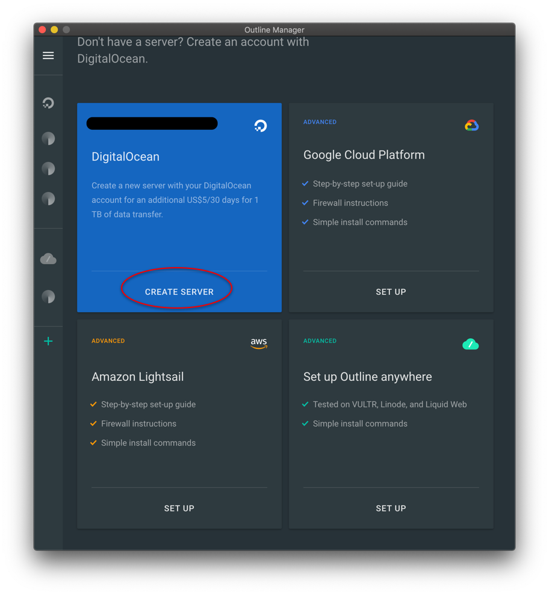
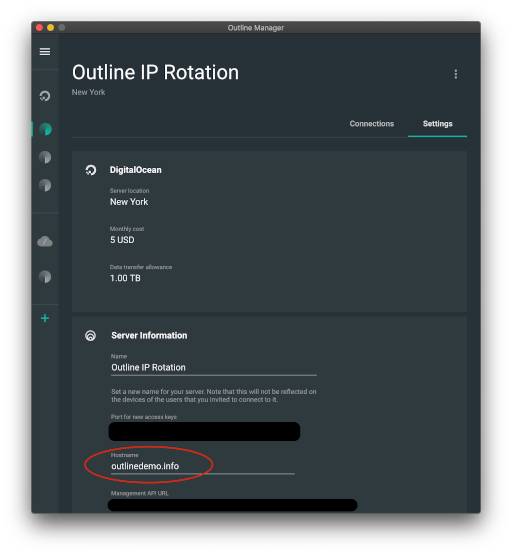
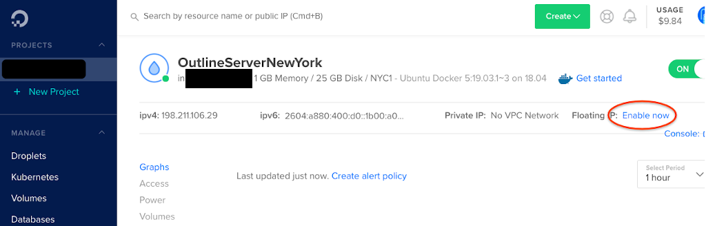
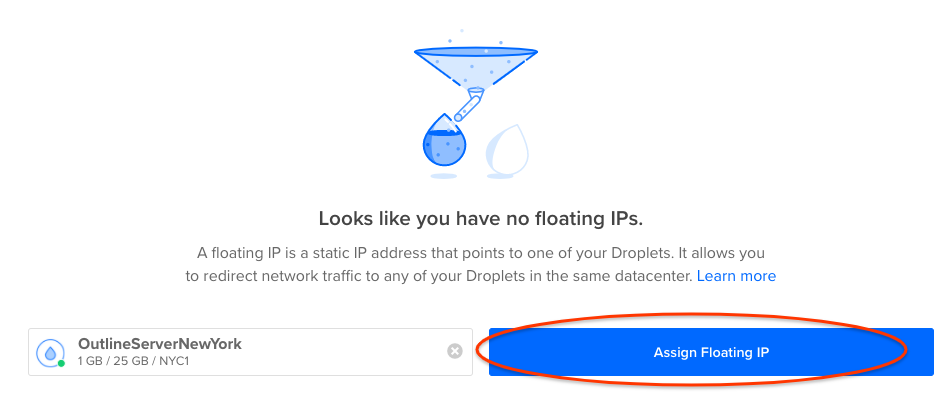
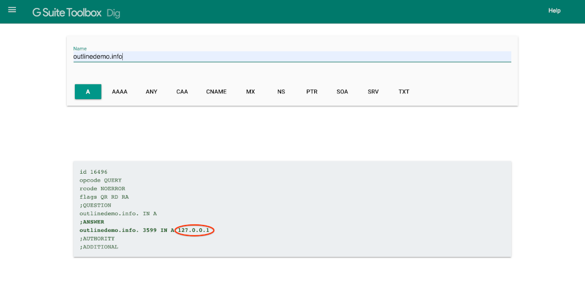

# Set Up a Blocking-Resistant Server With Floating IPs

## Introduction

Outline servers can sometimes face the problem of being discovered and blocked
from highly censored networks. It's possible and not too difficult to recover a
blocked server if it was set up correctly. We will do this using DNS, the
Internet technology which translates domain names (like `getoutline.org`) to
physical IP addresses (like `216.239.36.21`), and Floating IPs, a cloud feature
which lets you assign more than one IP address to an Outline server.

## Requirements

There is a low level of technical skill needed to follow this guide. A basic
understanding of DNS is helpful, but not required. See the
[MDN](https://developer.mozilla.org/docs/Learn/Common_questions/What_is_a_domain_name)
guide on domain names for an introduction.

To have a concrete example we will use DigitalOcean and Google Domains, but any
cloud provider which allows assignment of IP addresses (e.g. Google Cloud or
[AWS Lightsail](https://lightsail.aws.amazon.com/ls/docs/en_us/articles/lightsail-create-static-ip))
and any domain registrar (e.g.
[AWS Route 53](https://lightsail.aws.amazon.com/ls/docs/en_us/articles/amazon-lightsail-using-route-53-to-point-a-domain-to-an-instance))
will work just as well.

## Instructions

1. The following list summarizes the steps to rotate the IP address of a server:

1. Purchase a domain name.

1. Point the domain name to our server's IP address.

1. Issue access keys using the domain name.

1. Assign a Floating IP to the server's Droplet.

1. Change the domain name to point at the new IP address.

## Create an Outline Server on DigitalOcean

If you have a running DigitalOcean server, skip to the next step.

1. Open Outline Manager and Click "+" at the bottom left to enter the server
  creation screen.

1. Click "Create Server" on the "DigitalOcean" button and follow the directions
  in the app.

## Make a Hostname for Your Server

<!-- TODO: Revamp now that Google Domains is no more. -->

3. Navigate to [Google Domains](https://domains.google.com/m/registrar/) and
  click "Find the perfect one".

4. Enter a domain name in the search bar and choose a name. We used
  `outlinedemo.info` as an example.

5. Navigate to the DNS tab on Google Domains. Under "Custom Resource Records",
  type your server's IP address in the field marked "IPV4 address".

6. Navigate to the "Settings" tab for your server in Outline Manager. Under
   "Hostname", type the hostname you purchased and click "SAVE". This will make
   all future access keys use this hostname instead of the server's IP address.

## Change the Server's IP address

7. Navigate to your server on DigitalOcean's "Droplets" page.

8. Click "Enable Now" in the top right of the window next to "Floating IP".

9. Find your server in the list of Droplets and click "Assign Floating IP".

10. Navigate back to the DNS tab on Google Domains.

11. Change the IP address as before, but this time with the new Floating IP
    address. This may take up to 48 hours to take place, but often it only takes
    a few minutes.

12. Navigate to [Google's Online DNS tool](https://toolbox.googleapps.com/apps/dig/#A/)
    and enter your domain name to see when the change in the last step took
    place.

Once this change propagates, clients will now connect to the new IP address. You
can connect to your server with a new key and open <https://ipinfo.io> to make
sure that you see your server's new IP address.

Conclusion
Rotating IP addresses of an Outline server can be a fast way to unblock a server
and restore service to clients. For more questions, feel free to comment on the
[announcement post](https://redd.it/hrbhz4), visit
[Outline's support page](https://support.getoutline.org/) or
[contact us directly](https://support.getoutline.org/s/contactsupport).